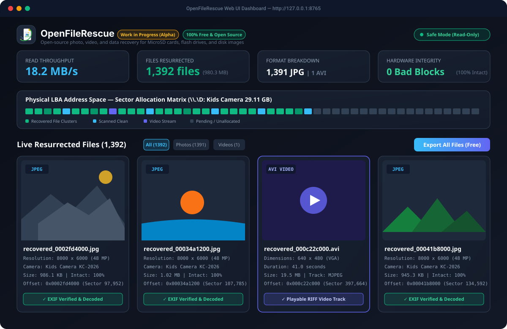
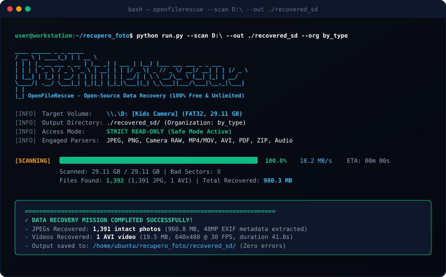

<p align="center">
  
</p>

<h1 align="center">OpenFileRescue</h1>

<p align="center">
  <strong>The modern, open-source file, photo, video, and data recovery tool for MicroSD cards, flash drives, and disk images.</strong><br>
  <em>100% Free, Unlimited (No artificial 500 MB paywalls), and strictly Read-Only.</em>
</p>

<p align="center">
  <a href="LICENSE"></a>
  
  <a href="https://www.python.org/"></a>
  <a href="https://github.com/astral-sh/uv"></a>
  <a href="Dockerfile"></a>
  
  
  
</p>

> [!WARNING]
> **Project Status: Work in Progress (Alpha)**  
> This project is under active development. While it has already been proven in real-world testing to resurrect thousands of deleted photos and videos from degraded FAT32 microSD cards, community contributions, bug reports, and new format parsers are warmly welcomed!

---

## 🌟 Why OpenFileRescue?

Commercial data recovery suites (such as *Disk Drill, EaseUS Data Recovery, Wondershare Recoverit*, etc.) typically charge between **$70 and $120 per year** and rely on deceptive freemium tactics: they scan your drive and show thumbnails, but **block recovery behind an artificial 500 MB paywall** demanding a credit card.

On the other hand, traditional open-source command-line tools (like `photorec` from TestDisk) have reliable carving algorithms but use an archaic, intimidating 1990s ncurses terminal interface that deters non-technical users.

**OpenFileRescue** bridges this gap:
1. **High-Performance Deep File Carving Engine**: Low-level sector and cluster analysis for photos, videos, documents, and archives.
2. **Modern, Responsive Web UI**: Real-time LBA sector map visualization, live discovery gallery with EXIF thumbnail extraction, and full-screen lightbox inspection.
3. **Headless Command-Line Interface (CLI)**: Full interactive wizard, batch recovery, and terminal ASCII progress bars for remote servers, headless rigs, and automation.
4. **100% Free & Open-Source Forever**: No recovery limits, no paywalls, no subscriptions, no locked features.
5. **Hardware Safety First**: Device handles are opened in **STRICT READ-ONLY mode** (`O_RDONLY` / `FILE_SHARE_READ`), preventing NAND flash write wear or partition table alteration. Includes a built-in bitstream cloner (`.img` generator).

---

## 📸 Interface Previews

### Web UI Dashboard & Real-Time Sector Map


### Headless CLI Mode


---

## 🚀 Key Features & Supported Formats

- **🔍 Low-Level Deep Signature Carving**:
  - **Photos & Images**:
    - **JPEG / JFIF / EXIF**: Marker-accurate parsing (`0xFFD8` SOI to `0xFFD9` EOI), segment validation (`0xFFE1`), automatic extraction of **Camera Make & Model** (DSLR, Action Cam, Smartphone, Kids Camera), original **Date Taken**, dimensions, and embedded thumbnails.
    - **PNG**: Byte-accurate chunk-by-chunk walking from `IHDR` to `IEND` with CRC32 verification.
    - **Camera RAW**: Canon (`.CR2`/`.CR3`), Nikon (`.NEF`), Sony (`.ARW`), Adobe (`.DNG`), Fujifilm (`.RAF`).
  - **Videos**:
    - **MP4 / MOV / 3GP / M4V**: ISO base media file format atom parser (`ftyp`, `moov`, `mdat`), with support for action-camera recordings where `mdat` precedes `moov`.
    - **AVI / DivX**: RIFF container parsing, extraction of video dimensions, framerate, and playback duration.
  - **Documents & Archives**:
    - **PDF**: Forward scanning from `%PDF-` header to trailer `%%EOF` marker.
    - **ZIP / Microsoft Office**: Reconstruction of PK-zip containers (`.zip`), Word (`.docx`), Excel (`.xlsx`), and PowerPoint (`.pptx`).
  - **Audio**:
    - **MP3**: ID3 tag size synchronization and audio stream validation.
    - **WAV**: RIFF-WAVE audio containers.
- **🗺️ Real-Time Sector Grid Map**:
  - Interactive matrix representing the medium's LBA address space (modernized defrag-style), highlighting pending, scanned, intact, bad, and file-bearing sectors in real time.
- **🖼️ Live Discovery Gallery & Lightbox**:
  - Files pop up instantly as they are carved during the scan pass.
  - Inspect full metadata, camera details, timestamps, and preview at native resolution.
- **💾 Organized Batch Export**:
  - Export recovered files organized automatically into **File Type**, **Date Folders (Year/Month)**, **Camera Model**, or a flat folder.
- **🛡️ Safe Bitstream Cloner (.img Imager)**:
  - Safely dump failing or degraded flash cards to a raw byte-for-byte `.img` file before performing intensive recovery passes.
- **⚡ Zero Mandatory External Dependencies**:
  - Built purely on the Python 3 standard library. Runs out-of-the-box on Windows, Linux, and macOS without compiling C extensions or encountering package conflicts (Pillow is optional for thumbnail enhancements).

---

## 🧪 Real-World Benchmark Case Study

We tested OpenFileRescue on a degraded 32 GB (29.11 GB usable) Class-10 FAT32 microSD card containing **only 25 active visible photos** in Windows Explorer:
- **Scan Throughput**: Averaged **18.2 MB/s** sustained sequential read speed over USB 2.0.
- **Files Resurrected**: Successfully recovered **1,391 previously deleted intact JPEG photos (960.8 MB)** + **1 AVI video (19.5 MB)** from unallocated clusters.
- **Total Recovered Data**: **980.3 MB** of verified readable media.

👉 **Read the full benchmark report**: **[docs/REAL_WORLD_BENCHMARK.md](docs/REAL_WORLD_BENCHMARK.md)**

---

## 📁 Repository Structure

```
OpenFileRescue/
├── openfilerescue/
│   ├── core/
│   │   ├── reader.py             # Safe Read-Only disk & image reader
│   │   ├── carver.py             # Multi-threaded signature carving engine
│   │   ├── carver_bridge.py      # Windows Win32 device bridge & IPC stream
│   │   ├── parsers/              # Format-specific decoders
│   │   │   ├── jpeg.py           # JPEG/EXIF decoder & thumbnail extractor
│   │   │   ├── png.py            # PNG chunk validator (IHDR -> IEND)
│   │   │   ├── raw.py            # Camera RAW parsers (Canon, Nikon, Sony, DNG, Fuji)
│   │   │   ├── video.py          # MP4 / MOV / 3GP ISO atom carver
│   │   │   ├── avi.py            # RIFF-AVI video carver
│   │   │   ├── document.py       # PDF and ZIP / Office (DOCX, XLSX) carver
│   │   │   └── audio.py          # MP3 and WAV audio carvers
│   │   ├── imager.py             # Bitstream cloner (.img creator) with bad sector resilience
│   │   └── exporter.py           # Path-sanitized organized exporter
│   ├── server/
│   │   └── server.py             # Embedded multi-threaded HTTP/REST API
│   ├── web/                      # Modern dark-mode web dashboard
│   │   ├── index.html            # User interface
│   │   ├── css/style.css         # Styling, glassmorphism & sector visualizer
│   │   └── js/app.js             # Real-time telemetry, gallery & export logic
│   └── cli.py                    # Headless Command Line Interface
├── tests/
│   ├── make_test_disk.py         # Synthetic disk image generator
│   ├── test_carver.py            # Automated carver unit tests
│   ├── test_parsers.py           # Parser unit tests (JPEG, PNG, AVI, MP4, PDF, ZIP, WAV)
│   └── test_e2e_api.py           # End-to-end API & export integration test
├── docs/
│   ├── REAL_WORLD_BENCHMARK.md   # Dedicated real-world microSD recovery case study
│   └── assets/                   # Vector preview graphics & screenshots
├── run.py                        # Universal entrypoint & browser launcher
├── run_windows.bat               # 1-Click launcher for Windows
├── run.sh                        # 1-Click launcher for Linux / macOS
├── pyproject.toml                # Modern PEP 621 package metadata & entrypoints
├── LICENSE                       # MIT License with data recovery liability disclaimer
├── CONTRIBUTING.md               # Contribution guidelines & coding standards
├── CODE_OF_CONDUCT.md            # Contributor Covenant Code of Conduct
└── SECURITY.md                   # Security vulnerability disclosure policy
```

---

## ⚡ Quick Start (Choose Your Preferred Method)

OpenFileRescue is designed to require **minimal to zero prerequisites**. You do not even need Python installed on your computer if you choose the Astral UV or Docker methods.

### Option A: Astral UV 🚀 *(Recommended - Zero Python Pre-installation)*
[Astral UV](https://github.com/astral-sh/uv) is a blazingly fast Python runner that automatically downloads and manages the exact required Python environment in an isolated sandbox.

1. **Install UV** (1-second install, zero administrative/sudo privileges needed):
   - **Linux & macOS**:
     ```bash
     curl -LsSf https://astral.sh/uv/install.sh | sh
     ```
   - **Windows (PowerShell)**:
     ```powershell
     powershell -ExecutionPolicy ByPass -c "irm https://astral.sh/uv/install.ps1 | iex"
     ```
2. **Run OpenFileRescue**:
   ```bash
   uv run run.py
   ```
   *That's it! UV will resolve Python, prepare dependencies in milliseconds, and launch the Web UI.*

   > **Tip**: You can even run OpenFileRescue directly from GitHub without cloning:
   > ```bash
   > uvx --from git+https://github.com/giga89/OpenFileRescue openfilerescue-gui
   > ```

---

### Option B: Docker & Docker Compose 🐳 *(100% Containerized, Zero Host Dependencies)*
If you have Docker installed, you can spin up the full recovery dashboard with a single command:

```bash
# Start the web dashboard (binds to http://localhost:8765)
docker compose up
```

- **Recovered Files**: Saved persistently to `./recovered_files` on your host machine.
- **Disk Images**: Place any `.img` / `.raw` disk images into `./images/` to scan them inside the container.

#### Scanning Physical Block Devices on Linux with Docker
To scan physical SD cards or block devices directly (`/dev/sdX`):
```bash
docker run --privileged --rm -it -p 8765:8765 \
  -v /dev:/dev \
  -v $(pwd)/recovered_files:/app/recovered_files \
  openfilerescue:latest
```

#### Running Headless CLI in Docker
```bash
docker compose run --rm openfilerescue-cli
```

---

### Option C: 1-Click Launchers & Standard Python 🐍

#### Windows 🪟
Double-click `run_windows.bat` (or run in PowerShell):
```cmd
run_windows.bat
```
*The launcher automatically detects UV, Python, or Docker on your system, and launches the dashboard at `http://127.0.0.1:8765`.*

#### Linux / macOS 🐧 🍏
```bash
chmod +x run.sh && ./run.sh
```
Or with standard Python 3 (Python 3.9+):
```bash
python3 run.py
```

---

## 💻 Command-Line Interface (CLI Mode)

OpenFileRescue includes a headless CLI to scan, carve, clone, and recover files over SSH, terminal, or automated scripts without requiring a web browser:

```bash
# 1. Interactive Recovery Wizard (recommends drives, prompts for settings)
python run.py --cli

# 2. List all connected drives, removable SD cards, and disk images
python run.py --list

# 3. Scan a specific drive or disk image in Read-Only mode
python run.py --scan D:\ --out ./recovered_files --org by_type

# 4. Fast sector cluster scan (for high-speed scanning of large media)
python run.py --scan /dev/sdb --step 4096 --out ./recovered

# 5. Safe bitstream clone (dump physical card to raw .img before scanning)
python run.py --clone D:\ --dest microsd_backup.img

# 6. Instant demo test (no physical media needed)
python run.py --demo
```

### CLI Options Reference
| Flag | Description |
| :--- | :--- |
| `-c, --cli` | Launch the interactive terminal wizard |
| `-s, --scan <path>` | Path to block device, drive letter (`D:\`), or `.img` file |
| `-l, --list` | List all detected storage media and disk images |
| `-o, --out <dir>` | Destination folder for recovered files (default: `recovered_files`) |
| `--org <mode>` | Organization structure: `by_type`, `by_camera`, `by_date`, `flat` |
| `--step <bytes>` | Sector step size in bytes (`512` standard, `4096` fast cluster) |
| `--clone <src>` | Clone physical drive to raw `.img` file in read-only mode |
| `--dest <path>` | Destination path for clone image file |
| `--demo` | Create a 15 MB synthetic test image and run recovery verification |
| `-w, --web` | Launch embedded Web UI dashboard (default when no CLI flags given) |

---

## 🎮 Demo Mode (Test Without Physical Media)

You can test OpenFileRescue immediately without any physical cards:
1. Launch the application (`python run.py`).
2. Click the **"Create Demo SD Image"** button in the top navigation bar.
3. A 15 MB synthetic disk image containing simulated deleted photos and EXIF metadata will be generated.
4. Click **"Start Scan"** to watch the real-time sector visualizer and live gallery in action!

---

## 🗺️ Roadmap & Contributing

- [x] JPEG / JFIF / EXIF carver with camera metadata extraction
- [x] PNG chunk validator
- [x] MP4 / MOV / 3GP video atom carver
- [x] RIFF-AVI video carver
- [x] PDF document carver
- [x] ZIP / Office (DOCX, XLSX, PPTX) carver
- [x] MP3 & WAV audio carver
- [x] Real-time LBA sector grid visualizer
- [x] Read-Only physical drive access on Windows & Linux
- [x] One-click organized folder export (Type, Date, Camera, Flat)
- [ ] FAT32 / exFAT deleted directory entry reconstruction (recovering original directory hierarchy and names)
- [ ] Fragmented MP4 video stream stitcher
- [ ] Desktop standalone packaging (PyInstaller / Electron / Tauri)

Contributions, feature suggestions, and bug reports are welcome! Please read **[CONTRIBUTING.md](CONTRIBUTING.md)** before submitting a pull request.

---

## ⚖️ Legal & Licensing

### License
This project is licensed under the **[MIT License](LICENSE)**. You are completely free to use, study, modify, distribute, and integrate this software for personal or commercial purposes.

### Legal Disclaimer & Safe Harbor
- **Clean-Room Implementation**: All code in OpenFileRescue was authored independently from scratch based on publicly documented RFCs, ISO standards, and format specifications (ISO/IEC 10918-1, TIFF Revision 6.0, Exif standard JEITA CP-3451, ISO/IEC 15948, ISO/IEC 14496-12). No code was copied or derived from proprietary software or GPL-licensed projects.
- **"AS IS" - No Warranty**: Data recovery carries inherent risks when dealing with physically degraded, corrupted, or failing storage devices. While OpenFileRescue enforces read-only access flags, the software is provided "AS IS", without warranty of any kind. The authors and contributors shall not be held liable for any claims, data loss, or hardware failure. Always back up your media where possible.
- **Nominative Trademark Fair Use**: Any product, format, or company names (such as SD, MicroSD, Windows, Canon, Nikon, Sony, Fujifilm, Apple) are trademarks™ or registered trademarks® of their respective owners. Their use in this repository is purely descriptive to identify file format and hardware compatibility under nominative fair use. OpenFileRescue is not affiliated with or endorsed by any of these entities.
