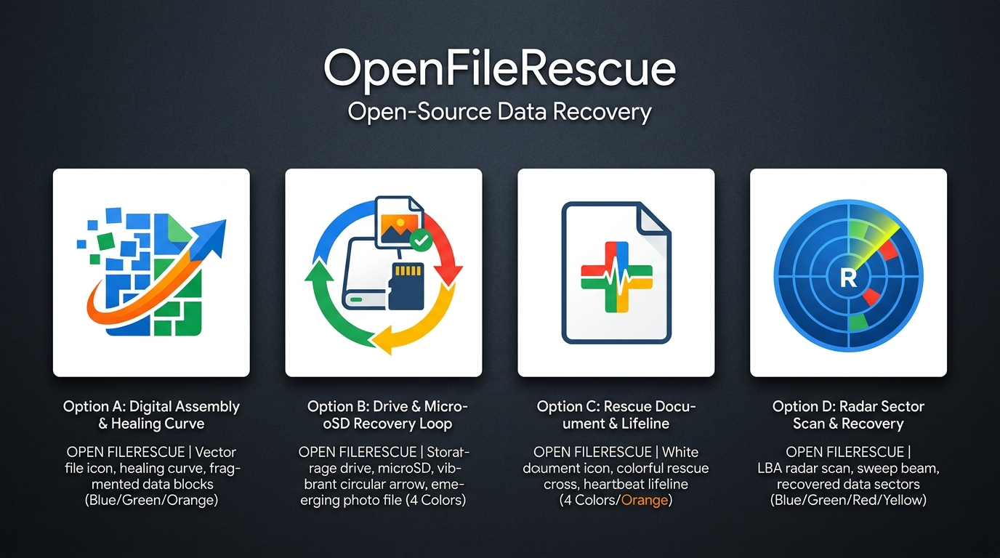

# 🎨 OpenFileRescue — New Logo Design Proposals

Hai perfettamente ragione: il logo precedente con il solo salvagente nautico sembrava più un'app generica da spiaggia che un vero software di **Data Recovery forense e ripristino file**.

Abbiamo progettato **4 nuovi concept esclusivi in puro stile Flat Google** (forme geometriche pulite, palette Material You con Blu, Verde, Giallo/Ambra e Rosso/Corallo, leggibili istantaneamente sia a 16x16 pixel sia su display 4K).

---

## 🖼️ Anteprima Comparativa

---

## 🔍 Dettaglio delle 4 Proposte

### 🔹 **Opzione A: "The Healed File" (Ricostruzione Dati Frammentati)**
* **File SVG:** [`assets/logo_proposal_1.svg`](assets/logo_proposal_1.svg)
* **La metafora visiva:** Un documento fotografico le cui parti inferiori sono costituite da frammenti di pixel e blocchi binari sparsi (i settori cancellati/corrotti). Una curva dinamica di ripristino (swoosh) attraversa i frammenti e li ricompone magicamente in un file integro e verificato.
* **Punto di forza:** Comunica istantaneamente l'idea di *"file rotto o cancellato che torna in vita"*.

---

### 🔹 **Opzione B: "The Restore Loop & Storage Card" (Consigliata ⭐)**
* **File SVG:** [`assets/logo_proposal_2.svg`](assets/logo_proposal_2.svg)
* **La metafora visiva:** Combina il supporto fisico (scheda microSD / hard disk) con la **freccia circolare antioraria universale di "Restore / Undo"**. Dal cuore della scheda emerge verso l'alto il file fotografico recuperato, completo di badge di verifica verde.
* **Punto di forza:** È il simbolo più universale e inconfondibile di recupero dati hardware/software. Chiunque lo veda capisce in mezzo secondo che si tratta di un'operazione di ripristino da memoria flash.

---

### 🔹 **Opzione C: "Digital First-Aid" (Pronto Soccorso dei Dati)**
* **File SVG:** [`assets/logo_proposal_3.svg`](assets/logo_proposal_3.svg)
* **La metafora visiva:** Il classico foglio digitale con una **croce medica di emergenza/salvataggio** a 4 colori piatti Google (blu, verde, giallo, rosso), attraversata alla base da una linea di battito vitale/impulso verde.
* **Punto di forza:** Evoca con forza il concetto di *"ospedale / soccorso per schede SD danneggiate"*.

---

### 🔹 **Opzione D: "Radar Sector Carver" (Scansione LBA & Scoperta)**
* **File SVG:** [`assets/logo_proposal_4.svg`](assets/logo_proposal_4.svg)
* **La metafora visiva:** Riprende direttamente l'anima tecnica del nostro software: il **radar di scansione dei settori LBA**. Il fascio radar scandaglia la matrice scura dei cluster non allocati e illumina il file fotografico ritrovato.
* **Punto di forza:** Molto tecnico, professionale e coerente con la schermata a blocchi della dashboard.

---

## 📊 Tabella Comparativa

| Criterio | Opzione A (Healed File) | Opzione B (Restore Loop ⭐) | Opzione C (First-Aid) | Opzione D (Radar Carver) |
| :--- | :---: | :---: | :---: | :---: |
| **Chiarezza concetto "Recovery"** | ⭐⭐⭐⭐☆ (Ricostruzione) | ⭐⭐⭐⭐⭐ (Restore universale) | ⭐⭐⭐⭐☆ (Soccorso) | ⭐⭐⭐⭐☆ (Scansione) |
| **Legame con Hardware / SD** | ⭐⭐⭐☆☆ | ⭐⭐⭐⭐⭐ (MicroSD esplicita) | ⭐⭐☆☆☆ | ⭐⭐⭐⭐☆ (Settori LBA) |
| **Stile Flat Google** | ⭐⭐⭐⭐⭐ | ⭐⭐⭐⭐⭐ | ⭐⭐⭐⭐⭐ | ⭐⭐⭐⭐☆ |
| **Leggibilità a 16x16 / Favicon** | ⭐⭐⭐⭐☆ | ⭐⭐⭐⭐⭐ | ⭐⭐⭐⭐⭐ | ⭐⭐⭐☆☆ |
